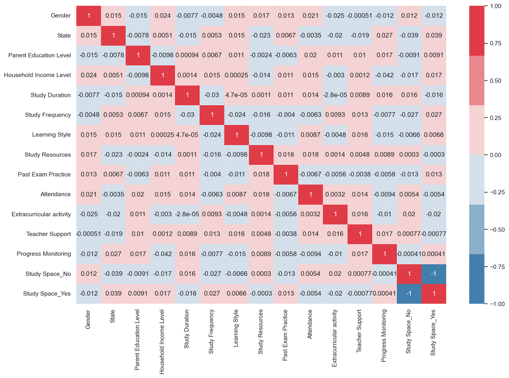
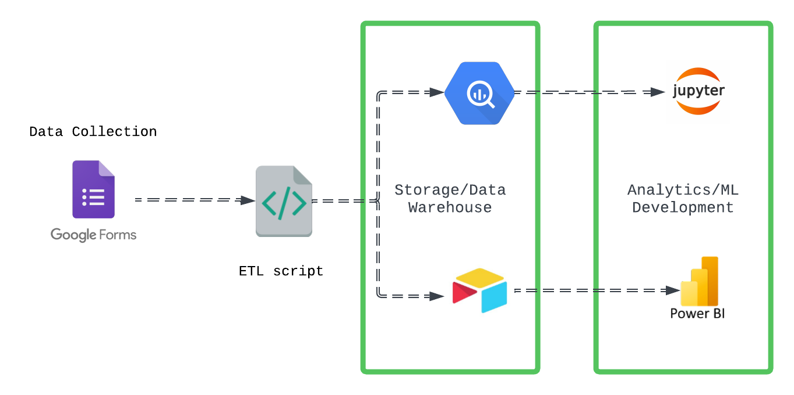

# DataFest Africa 2024 DataThon

# Improving Academic Outcomes in Africa: Leveraging Data Analytics
The sub-par quality of secondary education in **Africa**, as evidenced by the low scores in recent **JAMB** exams, 
poses a significant challenge to student success. The project aims to address this issue by leveraging data analytics, 
machine learning and data engineering to identify underlying problems and develop targeted solutions to improve student performance.

## Project Goals
* Identify key factors hindering student performance in exams like JAMB and WASSCE.
* Develop a data-driven solution to proactively improve student outcomes.
* Create a predictive model to forecast student success or failure.
* Provide actionable recommendations to stakeholders for enhancing student performance.

## Methodology

### Data Collection

* Survey Administration: Conducted [survey](https://forms.gle/KhFiKMAjwgAnDSn29) with students who participated in the 2024 JAMB, WASSCE, and NECO exams to gather comprehensive data on their academic history, demographics, learning styles, and other relevant factors.
* Data Ingestion: The collected survey data was ingested into a data warehouse for subsequent analysis and modeling.

### Data Analysis

* Exploratory Data Analysis (EDA): Employed EDA techniques to identify patterns, trends, and correlations within the data.
* Factor Analysis: Analyzed factors such as teacher support, learning style, extracurricular activities, study duration, numeracy and reading skills, and parental involvement to understand their impact on student performance.

### Model Development

* Machine Learning Algorithms: Utilized machine learning algorithms, such as regression, decision trees, or random forests, to create a predictive model capable of accurately forecasting student performance based on various factors.
* Model Optimization: Fine-tuned the model through hyperparameter tuning and cross-validation to enhance its predictive accuracy. 

### Solution Design

* Data-Driven Decision-Making: Developed a comprehensive data solution for schools, incorporating data collection, pipelining, warehousing, automation, and reporting capabilities.
* Technology Implementation: Implemented tools and technologies to support data-driven decision-making, enabling stakeholders to make informed choices based on data-driven insights.
* Predictive Modeling: Built a predictive model to forecast student performance and identify students at risk of underperforming in future exams.

## Outcomes

* In-depth Understanding: Gained a deeper understanding of the factors influencing student performance in African secondary schools.
* Data-Driven Solutions: Developed targeted interventions to address identified challenges and improve student outcomes.
* Actionable Recommendations: Provided recommendations to stakeholders on strategies to enhance student success.
* Predictive Model: Created a valuable tool for predicting student performance and identifying students who may require additional support.
* By leveraging data analytics and machine learning, this project has contributed to a more data-driven and effective approach to improving secondary education in Africa.

## Appendix

### 1. Data Exploration

**Key Insights from Exploratory Data Analysis (EDA)** 

* **Missing Values**: No missing values were found in the dataset. 

* **Data Distribution**: For all variables, the distribution of each unique category was nearly uniform, meaning that the categories appeared in roughly the same frequency across the dataset. This conveys that the data is well-balanced across the categories in each variable. 

* **Correlations**:There was no significant correlation between features. 

### 2. Data Warehouse
Take peek at our data [here](https://airtable.com/applJdHIsCb5z8Do2/shrS30jOLrtNxcvQH/tblDY76xjWl7mqBev) via airtable

#### 2.1 Data System Design

